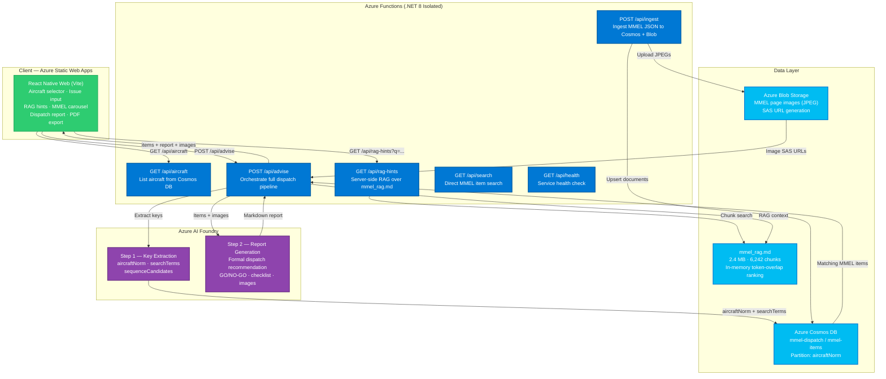
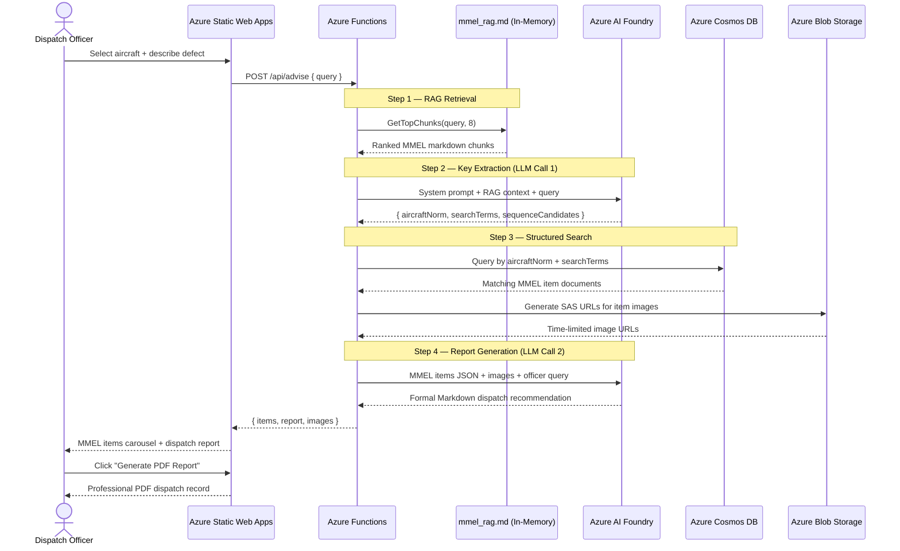

# ✈️ MMEL Dispatch Advisor

> **AI-powered aircraft dispatch decision support, grounded on official Minimum Equipment List (MMEL) documents.**

[](https://learn.microsoft.com/azure/azure-functions/)
[](https://learn.microsoft.com/azure/cosmos-db/)
[](https://learn.microsoft.com/azure/static-web-apps/)
[](https://ai.azure.com/)
[](LICENSE)
[](https://mango-hill-08190c01e.1.azurestaticapps.net/)

---

## 🌐 Live Application

> **[➡ Open the MMEL Dispatch Advisor](https://mango-hill-08190c01e.1.azurestaticapps.net/)**

Hosted on **Azure Static Web Apps** (free tier). No login required — select an aircraft type, describe a defect in plain language, and receive an AI-powered dispatch recommendation grounded in official MMEL documents within seconds.

---

## 🏆 Hackathon Submission

This project was built for a hackathon focused on **responsible AI in regulated industries**. It demonstrates how large language models can be safely deployed in safety-critical aviation operations by strictly grounding AI responses in official regulatory documents — with no hallucinations, no invented procedures, and full traceability to source material.

---

## 📖 What Is the MMEL?

The **Minimum Equipment List Master (MMEL)** is an FAA-approved document that defines which aircraft systems and components may be inoperative while still allowing the aircraft to fly — under specific conditions, time limits, and operational procedures. Every commercial airline derives its own MEL from the MMEL issued by the aircraft manufacturer.

Dispatch officers must consult the MMEL whenever an aircraft has a reported defect before releasing it for flight. This process is:

- **Time-critical** — turnaround times are tight and delays are costly
- **Safety-critical** — an incorrect dispatch decision can endanger lives
- **Document-intensive** — hundreds of pages of dense regulatory text per aircraft type

The **MMEL Dispatch Advisor** automates this lookup using AI, while keeping every recommendation anchored to the official regulatory source.

---

## 🎯 Software Functionality

### For the Dispatch Officer

1. **Select the aircraft type** from a dynamically populated list sourced live from the database (Airbus A220, A320, A330, A340, Boeing 737, 737 MAX, 747, 777, ATR 42/72, Embraer EMB-135/145, and more).

2. **Describe the defect in plain language** — e.g., *"cabin recirculation fans inoperative"* or *"left wing anti-ice valve stuck closed"*.

3. **Receive real-time hints** as you type — a debounced RAG search surfaces relevant MMEL item titles and sequence numbers before you even submit.

4. **Click Analyze Dispatch** — the system:
   - Runs a semantic RAG search over the MMEL knowledge base
   - Extracts aircraft type, affected system, and sequence candidates via an LLM
   - Queries the structured Cosmos DB for matching MMEL items
   - Passes those exact items to Azure AI Foundry for a formal dispatch recommendation

5. **Review the structured result**:
   - **MMEL Items panel** — every matching item with sequence, repair category, installed/required counts, and page image
   - **Dispatch Report** — formal recommendation including:
     - GO / NO-GO decision based on installed vs. required operative counts
     - Repair timeframes per class (A = per remarks, B = 3 days, C = 10 days, D = 120 days)
     - Maintenance action required — flagged when MMEL remarks contain `(M)`
     - Operational procedure required — flagged when remarks contain `(O)`
     - Checklist format for operational use

6. **Generate a PDF report** — professional, printable dispatch record with all MMEL items, the AI recommendation, and a compliance checklist.

---

## 🏗️ Architecture



### Data Flow — Dispatch Advisory Request



---

## ☁️ Azure Services

| Service | Tier | Role |
|---|---|---|
| **Azure Functions** | Linux Consumption (.NET 8 Isolated) | Serverless backend — all API endpoints, orchestration pipeline |
| **Azure Cosmos DB** | Serverless (SQL API) | Structured MMEL item database; partition key `/aircraftNorm` for sub-10ms lookups |
| **Azure Blob Storage** | LRS Standard | MMEL manual page images (JPEG); SAS URL generation for secure delivery |
| **Azure AI Foundry** | Pay-per-use | LLM inference — key extraction and formal report generation; supports Phi-4, GPT-4o, Llama, Mistral |
| **Azure Static Web Apps** | Free Tier | Frontend SPA hosting with CDN, global edge delivery, and SPA routing fallback |
| **Azure Application Insights** | Pay-per-use | Distributed telemetry, request traces, and sampling for the Function App |
| **Microsoft Entra ID** | Included | `DefaultAzureCredential` — Managed Identity for the Function App to call AI Foundry without secrets |

### Resource Topology

```
rg-mmel-dispatch-advisor  (West US 2)
├── mmel-dispatch-advisor         Azure Function App (Linux Consumption, .NET 8)
├── mmeldispatchstor              Azure Storage Account (Functions runtime + MMEL images)
├── mmel-dispatch                 Azure Cosmos DB — database: mmel-dispatch, container: mmel-items
├── mmel-dispatch-advisor-web     Azure Static Web Apps (Free tier)
└── [AI Foundry workspace]        Azure AI Foundry project + model deployment
```

---

## 🛡️ Responsible AI — Grounded on Official MMEL Documents

> **The AI never invents procedures, regulatory requirements, or dispatch conditions.**
> Every recommendation is strictly derived from official manufacturer MMEL documents.

### How Grounding Works

The system implements a **two-layer grounding architecture**:

#### Layer 1 — Retrieval-Augmented Generation (RAG)

A 2.4 MB Markdown knowledge base (`mmel_rag.md`) is generated directly from official MMEL source documents (Airbus, Boeing, ATR, Embraer — all manufacturer-issued). This file contains **6,242 structured chunks**, each covering one MMEL line item with fields including:

- Aircraft type and ATA chapter / sequence number
- Minimum equipment conditions
- Repair category (A / B / C / D)
- Installed and required operative counts
- Full verbatim remarks including `(M)` and `(O)` markers

The RAG layer retrieves the most semantically relevant chunks for the officer's query **before any LLM call is made**. The LLM only sees what the RAG layer provides — it has no access to general internet knowledge.

#### Layer 2 — Structured Database Verification

After the LLM extracts search keys from the RAG context, those keys query **Azure Cosmos DB** — a structured database populated from the same official MMEL JSON source files. The final report is generated from this structured database output, not from free-form LLM generation.

### Responsible AI Principles Applied

| Principle | Implementation |
|---|---|
| **Grounded** | All AI output generated from official MMEL documents only — no general knowledge or web access |
| **Transparent** | Every MMEL item is traceable to its ATA sequence number (e.g., `21-21-01`) and specific aircraft type |
| **Accountable** | Dispatch officers review every recommendation before acting; the PDF creates a formal audit trail |
| **Conservative** | When operative count falls below MMEL minimum, the system flags NO-GO regardless of LLM output |
| **Deterministic rules** | Repair class timeframes and `(M)`/`(O)` flags are applied by rule — not inferred by the LLM |
| **No hallucination path** | System prompt explicitly prohibits inventing regulations or items not present in the provided context |
| **Human in the loop** | The AI produces a recommendation; the qualified dispatch officer makes the final legal release decision |

### Supported MMEL Documents

| Manufacturer | Aircraft Types |
|---|---|
| **Airbus** | A220-100/300, A320, A330, A340 |
| **Boeing** | 737, 737 MAX, 747-400, 747-8, 777 |
| **ATR** | ATR 42, ATR 72 |
| **Embraer** | EMB-135, EMB-145 |

---

## 📁 Repository Structure

```
mmel-dispatch-advisor/
├── apps/
│   └── mobile/                  # Vite + React Native Web SPA
│       ├── src/App.tsx           # Main application component
│       ├── public/               # Static assets (banner, favicon, SWA config)
│       └── dist/                 # Production build output
├── backend/                     # Azure Functions (.NET 8 Isolated)
│   ├── Functions/               # HTTP triggers — 6 endpoints
│   ├── Services/                # RAG, Cosmos, Blob, Foundry, Advisor orchestration
│   ├── Models/                  # DTOs and Cosmos document shapes
│   ├── Options/                 # Strongly-typed configuration
│   └── host.json
├── documents/
│   ├── mmel/                    # Source MMEL JSON + PDF files (per aircraft type)
│   └── mmel_rag.md              # Generated RAG knowledge base (2.4 MB, 6,242 chunks)
└── scripts/
    ├── deploy-azure.ps1         # Deploy backend to Azure Functions
    ├── deploy-frontend.ps1      # Build + deploy SPA to Azure Static Web Apps
    ├── ingest-local.ps1         # Ingest MMEL documents into Cosmos + Blob
    └── test-63.ps1              # Smoke test all aircraft types
```

---

## 🚀 Getting Started

### Prerequisites

- [.NET 8 SDK](https://dotnet.microsoft.com/download/dotnet/8.0)
- [Azure Functions Core Tools v4](https://learn.microsoft.com/azure/azure-functions/functions-run-local)
- [Node.js 18+](https://nodejs.org/) and [Yarn](https://yarnpkg.com/)
- [Azure CLI](https://learn.microsoft.com/cli/azure/install-azure-cli) + active subscription
- Azure resources: Cosmos DB, Storage Account, AI Foundry project

### Backend — Local Development

```bash
cd backend
cp local.settings.json.example local.settings.json
# Fill in Cosmos, Blob, and Foundry connection details
dotnet build
func start
```

### Frontend — Local Development

```bash
cd apps/mobile
cp .env.example .env.local
# Set VITE_API_BASE_URL=http://localhost:7071
yarn install
yarn dev
# Open http://localhost:3000
```

### Ingest MMEL Data

```powershell
# From repo root — ingests all aircraft types into Cosmos + Blob
.\scripts\ingest-local.ps1
```

### Deploy to Azure

```powershell
# Backend — Azure Functions
.\scripts\deploy-azure.ps1

# Frontend — Azure Static Web Apps
.\scripts\deploy-frontend.ps1
```

---

## 🔌 API Reference

| Endpoint | Method | Auth | Description |
|---|---|---|---|
| `/api/health` | GET | Anonymous | Service health — Cosmos, Blob, RAG chunk count |
| `/api/aircraft` | GET | Anonymous | List all aircraft (`name`, `norm`) from Cosmos |
| `/api/rag-hints` | GET | Anonymous | Top 5 RAG chunks for `?q=&aircraft=` |
| `/api/search` | GET | Function Key | Search MMEL items by aircraft + query + sequence |
| `/api/advise` | POST | Function Key | Full advisory pipeline — returns `{ items, report, images }` |
| `/api/ingest` | POST | Function Key | Ingest MMEL JSON into Cosmos DB and Blob Storage |

---

## ⚙️ Configuration Reference

| Setting | Description |
|---|---|
| `Cosmos__ConnectionString` | Cosmos DB connection string |
| `Cosmos__DatabaseName` | Database name (default: `mmel-dispatch`) |
| `Cosmos__ContainerName` | Container name (default: `mmel-items`) |
| `Blob__ConnectionString` | Storage account connection string |
| `Blob__ContainerName` | Blob container for MMEL images |
| `Blob__SasExpiryMinutes` | SAS URL lifetime in minutes |
| `Rag__MarkdownPath` | Path to `mmel_rag.md` |
| `Rag__TopChunkCount` | RAG chunks passed to LLM (default: `8`) |
| `Foundry__ApplicationBaseUrl` | Azure AI Foundry endpoint (`…/protocols/openai`) |
| `Foundry__ModelDeployment` | Model deployment name |
| `Foundry__ApiVersion` | API version (default: `2025-11-15-preview`) |

---

## 📄 License

MIT License — see [LICENSE](LICENSE).

Photo credit: Banner image by [Joe Ambrogio](https://www.pexels.com/@joe-ambrogio) via [Pexels](https://www.pexels.com/photo/details-of-contemporary-airplane-in-hangar-in-sunlight-5493554/) (free to use).

---

<p align="center">
  Built for aviation safety &nbsp;·&nbsp; Powered by Azure AI Foundry &nbsp;·&nbsp; Grounded on official MMEL documents
</p>
