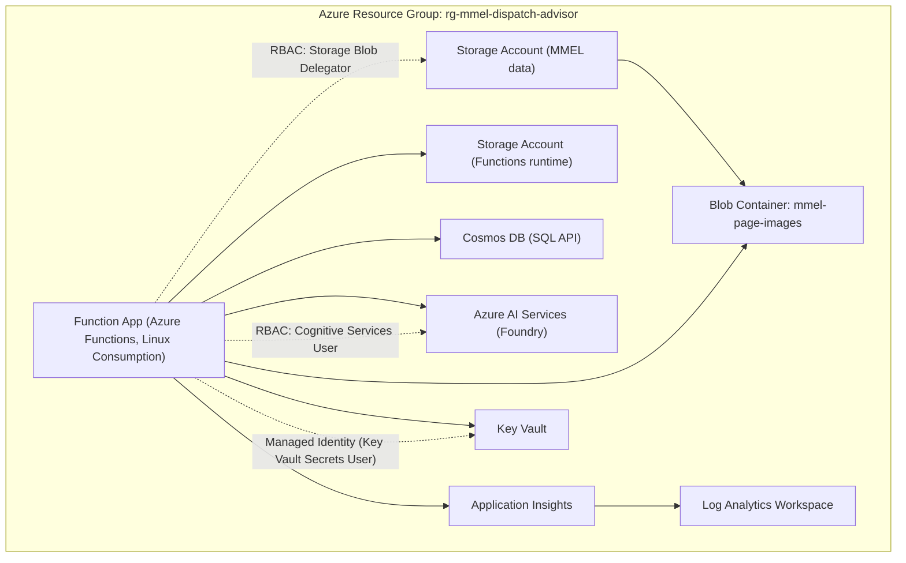
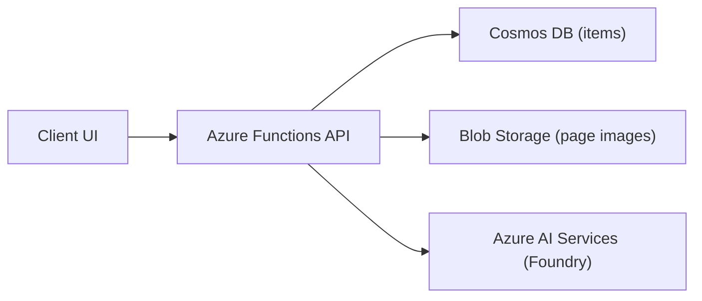

# Azure Architecture Diagrams

This file summarizes the Azure services used by MMEL Dispatch Advisor based on the deployment scripts in `scripts/`.

## Azure Resource Topology

## Runtime Data Flow (Azure Services Only)

